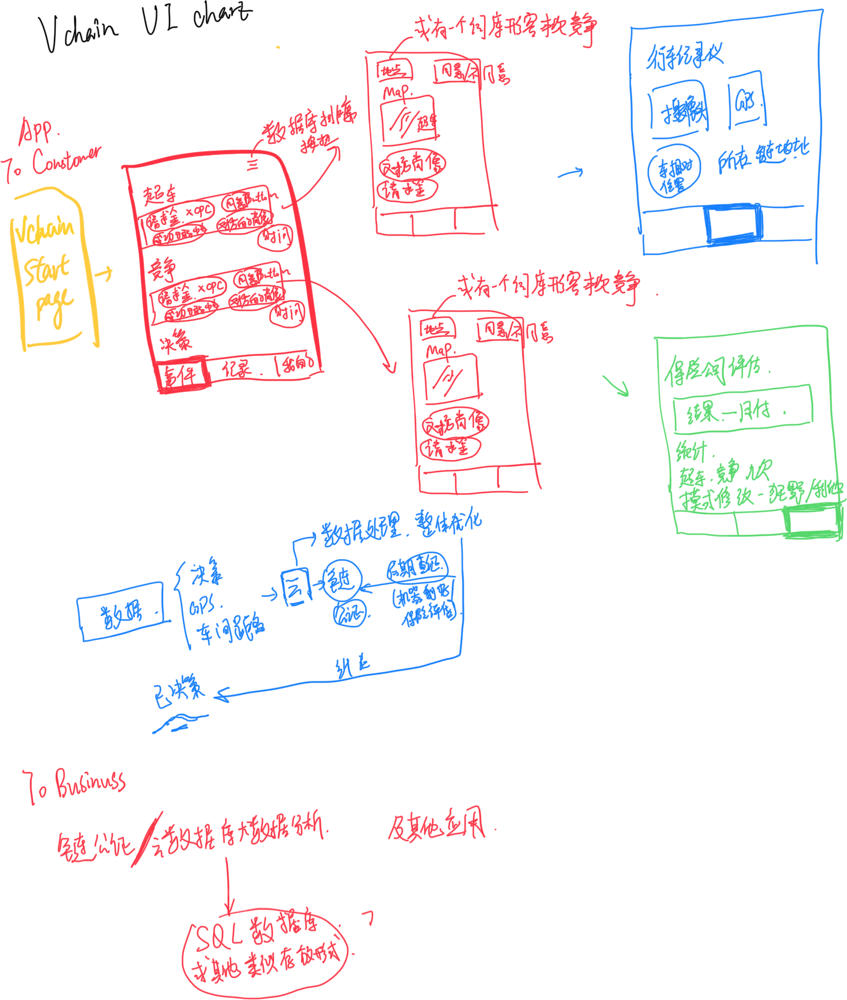

# 0x238E文档

Vchain 车联网

## 含义

全称Vehicle Chain，是一个基于区块链和车联网的驾驶辅助决策和保险评估系统

## 引入点

VChain的价值来自于驾驶辅助决策的应用和商业模式的创新，前者依托区块链的安全和计算的无延迟，后者是数据聚合和移动的结果。

1. 在一个范围内，多个车传感器及他们的数据事务，由CPChain创建的区块链信任。

2. 人工智能决策，基于物联网大数据的人工智能决策。异构数据互操作，形成大数据聚合。

3. 数据资产的交互与应用，数据资产在利用主链可验证的特点，惠及保险评估等新兴商业模式。

## 假设

本项目的假设是人主要操作汽车，汽车能自动完成某些特定的操作。

## 具体方案实施

### 车保险公司——个性化保险定价方案

(本部分具体数据库处理未写)

#### 实施途径

通过记录车辆驾驶数据

#### 实施方案

通过物体识别，识别车框架，将 “行车轨迹、多辆车相对距离、速度” 等数据传入区块链，记入云端，保险公司获取数据，形成用户肖像。针对不同类型的用户收取不同等级的车险费用。

#### 技术支持

GPS系统，传感器：距离传感器，速度传感器

#### 细节
##### 数据

1.	行车轨迹（GPS）

2.	相对距离

3.	速度

##### 用户类型

1. 冒险激进型

a)	高风险路段 e.g. 湿滑路段，盘山公路，事故多发路段……

b)	冒险行为 e.g. 随意变道，

c)	扣分记录

2. 平稳谨慎型：

a）规范行车 e.g. 平稳车速

b）文明礼让 e.g. 后方车辆欲超车，主动减速靠右

#### 特点：

1.	局域网络

2.	类似于行车记录仪

#### 优点

1. 车险公司有偿获取数据。

2. 数据真实，且实时记录更新。

3. 通过对行车高风险用户收取较高车险费提升公司收益。

### 优化用户（车主）决策方案

#### 实施途径

通过记录车辆驾驶数据

#### 实施方案

通过车身传感器进行车骨架分析，获取“多车相对距离、相对速度、决策行为（转向、速度）“等数据，将其上传至区块链，实时更新，结合GPS以及物体识别，在车载显示
屏上为用户提供最优决策方案提醒。

#### 技术支持

1. 车身 传感器：距离传感器，红外传感器，速度传感器、雷达传感器

2. 激光测距器视频摄像头

3. GPS系统

#### 细节 

数据：GPS地图导航，速度，方向 

决策：验证用户的决策是否最优-->进行指导提醒（驾驶辅助系统DAS）-->接受更正 最优行进方案：道路拥挤时，决策如何让道等待/行进使道路流通。 最优行驶路径：
使所有连入车联网的用户的行车用时最短

（驾驶辅助系统（DAS）：目的是为驾驶者提供协助，包括提供重要或有益的驾驶相关信息，以及在形势开始变得危急的时候发出明确而简洁的警告。本应用中为用户
提供最优行驶路径。）

#### 优点

1. 调度平台安全且相对快速，数据实时更新。	

2. 用户出行节省时间	

3. 疏通道路

### 超车无感支付

#### 实施途径

针对并行车辆的博弈结果经行虚拟货币自动交易

#### 实施方案

两车并行 双方博弈 被让行方支付小额虚拟币m，让行方获得小额报酬n（m>n, 矿工获取收益m-n）

#### 技术支持

1. 传感器：速度传感器、距离传感器

2. GPS

#### 细节 

数据:

a)	相对速度

b)	相对距离

c)	车辆并行

#### 优点

1. 公平性交易

2. 便利赶路者

#### 优化

1. 收益指数增长，减少兜车赚钱行为(驾驶人技术问题，开不快，就一直赚?)(后车请求前车让行)

2. 货币不足，自动关闭功能

### 前端

#### UI图

#### 事件

##### 超车

###### 背景

车主a需要赶时间且愿意支付代价，车主b愿意接受车主a的请求

###### 要求 

1. 只要逻辑开始就上链。（数据安全）

2. 没有完成超车需有惩罚。（行车安全）

##### 竞争

###### 背景

两车并排行驶时有发生，需要在危险发生前给予必要提醒。假设端处理器不能给出全局最优，且段处理器数据偏差，上传堵塞。假设车主专心开车。

###### 问题解决

1. 如果数据在等待时间内没有完成则跳过，同时记录跳过。

2. 如果在决策过程中有新的事件产生则跳转。（优先级超车>竞争）

## 使用设备即技术实现

### 车联网

车辆用树莓派3b+和jetson nano（完善程度80%）

1. opencv 拍照，物体识别画框（不稳定）

2. tensorflow 自动驾驶（仅jetson nano）

3. 实时算法计算最优路径（不稳定）

## demo 

用户界面 两个传感器的上链验证 规则

